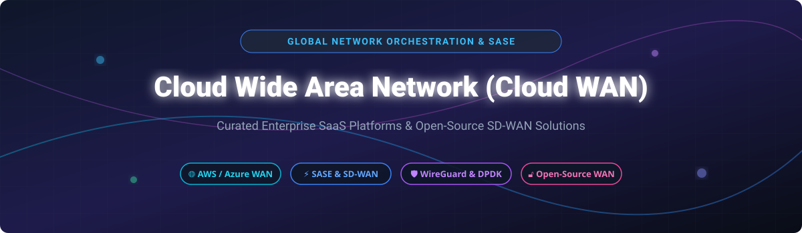

# Awesome-Cloud-Wide-Area-Network-Cloud-WAN

# Awesome-Cloud-Wide-Area-Network-Cloud-WAN 🌐 ☁️



  





  
  
  
  
  
  



---

## 🌟 Top Cloud Wide Area Network (Cloud WAN) Ecosystem

**Curated List of Commercial Cloud WAN Platforms & Open-Source SD-WAN/SASE Tools**  
*Focused on Global Network Orchestration, SD-WAN Overlay, SASE Convergence, Site-to-Cloud Connectivity & Self-Hosted WAN Optimization*

**Last updated: October 2026** 📅

---

### 📌 Overview & SEO Summary
Welcome to the ultimate curated directory of **cloud wide area network platforms**, **open-source SD-WAN frameworks**, and **SASE (Secure Access Service Edge) tools**. Whether you are looking for enterprise-grade commercial solutions (such as *AWS Cloud WAN*, *Azure Virtual WAN*, and *Cato Networks*), or self-hostable open-source alternatives (like *Pangolin*, *Queqiao*, and *Open SD-WAN CPE*), this list covers category leaders, policy-driven segmentation, and privacy-respecting global connectivity.

---

## 📑 Table of Contents
- [🏢 SaaS & Commercial Platforms](#-saas--commercial-platforms)
- [🔓 Open-Source GitHub Projects](#-open-source-github-projects)
- [🛠️ How to Contribute](#%EF%B8%8F-how-to-contribute)
- [📊 Star History](#-star-history)
- [🤝 Support & Sponsorship](#-support--sponsorship)
- [⚠️ Disclaimer](#%EF%B8%8F-disclaimer)

---

## 🏢 SaaS / Commercial Platforms

The cloud WAN market spans **hyperscaler native services** (AWS Cloud WAN, Azure Virtual WAN, Google NCC) that provide **policy-driven global networking within their ecosystems**, and **specialized SD-WAN/SASE platforms** (Cato, Aryaka, Palo Alto Prisma SD-WAN) that offer **managed connectivity and security convergence**. **AWS Cloud WAN** charges based on **core network edge attachments and data processing** . **Azure Virtual WAN Standard Hub** costs **¥2.544/hour plus ¥0.2034/GB** . **Aryaka** starts at **$150/site/month** for managed SD-WAN/SASE . **Prisma SD-WAN** requires a **base subscription per ION device** with optional security add-ons .

| SaaS / Commercial Platform | Company / Owner | Valuation / Market Cap | Standard Edition Starting Price | Free Tier / Free Trial Limits | Description |
| :--- | :--- | :--- | :--- | :--- | :--- |
| **[AWS Cloud WAN](https://aws.amazon.com/cloud-wan/)** ☁️ | Amazon | ~$2.0 Trillion | **Pay-per-use** (core network edge attachments + data processing) | **No upfront costs**; pay-as-you-go | **AWS-native global WAN** — **Centralized policy document (CNP)** defines segments, Regions, and attachments . **Full-mesh peering** between core network edges for high resilience. **Segments** act as dedicated routing domains for isolation . |
| **[Azure Virtual WAN](https://azure.microsoft.com/en-us/products/virtual-wan/)** 🔷 | Microsoft | ~$3.90 Trillion | **Standard Hub: ¥2.544/hour** + **¥0.2034/GB**  | **Free tier: limited** | **Azure-native global WAN** — **Hub-and-spoke with full-mesh hubs** in Standard tier . **Any-to-any connectivity** across branches, VNets, and ExpressRoute . **Azure Firewall Manager** for centralized security. |
| **[Google Cloud Network Connectivity Center](https://cloud.google.com/network-connectivity-center)** 🌐 | Google (Alphabet) | ~$2.0 Trillion | **Pay-per-use** (spokes + data processing) | **$300 free credits** | **GCP-native transit hub** — **Hub-and-spoke orchestration** with VPC, hybrid, and gateway spokes . **Site-to-site data transfer** using Google's global network as WAN . **NCC Gateway** for third-party SSE inspection . |
| **[Cato Networks](https://www.catonetworks.com/)** 🛡️ | Cato Networks | Private | **$1.00/year** (starting, per SoftwareAdvice)  | **Free trial available** | **Converged SASE platform** — **Single cloud-native platform** for SD-WAN and security. **Easy to deploy and stable** with global PoPs . |
| **[Aryaka](https://www.aryaka.com/)** ⚡ | Aryaka | Private | **$150/site/month** (SD-WAN/SASE managed service)  | **Demo available** | **Managed SD-WAN/SASE** — **Global private backbone** for application acceleration. **Fully managed service** with lifecycle support. **Made affordable for SMBs** . |
| **[Palo Alto Prisma SD-WAN](https://www.paloaltonetworks.com/sase/sd-wan)** 🔴 | Palo Alto Networks | ~$60 Billion | **Base subscription per ION device** + security add-ons  | **Demo available** | **SASE-integrated SD-WAN** — **ION hardware/software** for branch and data center . **Flexible licensing** with SD-WAN or SD-WAN + Branch Security . **Prisma Access** for full SASE. |
| **[Cisco Catalyst SD-WAN](https://www.cisco.com/)** 🔵 | Cisco | ~$200 Billion | **Custom enterprise pricing** | **Demo available** | **Enterprise SD-WAN** — **Cloud OnRamp for Multicloud** automates cloud connectivity . **Deep integration** with Cisco Catalyst 8000V and existing WAN transports. |
| **[VMware SD-WAN (VeloCloud)](https://www.vmware.com/)** 🏢 | Broadcom (VMware) | ~$60 Billion | **BYOL + Azure infrastructure costs**  | **Demo available** | **Cloud-delivered SD-WAN** — **Dynamic Multi-Path Optimization (DMPO)** for reliable transmission over Internet . **Multi-tenant gateways** for service providers. |
| **[Fortinet Secure SD-WAN](https://www.fortinet.com/)** 🟢 | Fortinet | ~$60 Billion | **Custom per-appliance licensing**  | **Demo available** | **Security-first SD-WAN** — **Integrated NGFW, ZTNA, and SD-WAN** in a single appliance . **SD-WAN Service Bundle** licensing for branch and hub devices . |
| **[Versa Networks](https://versa-networks.com/)** 🟣 | Versa Networks | Private | **Consumption-based** (pay-as-you-go per tenant)  | **Demo available** | **Sovereign SASE platform** — **Deployed on customer's own infrastructure** for data sovereignty . **Success-based pricing** with minimal upfront investment . |

---

## 🔓 Open-Source GitHub Projects

*Sorted by GitHub_Stars_Count (Descending)* 🌟

- **[Pangolin](https://github.com/fosrl/pangolin)**   
  **Open-source SASE platform built on WireGuard**, AGPL-3.0 licensed. **Connects and protects users, infrastructure, and AI workloads** — zero-trust VPN, reverse proxy, privileged access management, and identity-aware AI gateway sharing one policy model . **Self-hostable and lightweight** — runs on a small server with a user-space connector. **NAT traversal** punches through restrictive firewalls without public IPs or open ports . **Browser-based access** for HTTPS, VNC, RDP, and SSH . **The most complete open-source SASE alternative** to Cloudflare One, Zscaler, and Prisma . 🛡️

- **[Queqiao](https://github.com/bojieli/queqiao)**   
  **Self-hosted WAN optimization proxy for difficult long-haul links**, open-source. **Authenticated QUIC transport with TLS/TCP fallback** and SOCKS5 ingress . **Treats packet loss as erasure, not congestion** — sliding-window coding and aggregate pacing . **`queqiaod segments`** profiles live tunnels to identify **which segment the loss is on**: client access link, long haul, or gateway transit . **One-time invitations, per-device mutual TLS, renewal, and revocation** . **Native binaries for six platforms** with signed releases and SBOMs . **The most innovative open-source WAN optimization tool** . 🌉

- **[Open SD-WAN CPE (IEEE)](https://ieeexplore.ieee.org/document/11038877)**   
  **Open-source SD-WAN Customer Premises Equipment with DPDK and WireGuard**, open-source. **Fast packet processing via DPDK** for low-latency, high-throughput communication . **Supports VM and bare-metal deployment** . **WireGuard tunneling** for site-to-site and hub-and-spoke topologies . **Rapid failover via Bidirectional Forwarding Detection (BFD)** with real-time performance monitoring . **Published at IEEE conference 2025** — research-grade with production potential . ⚡

- **[Istio Federation](https://github.com/openshift-service-mesh/federation)**   
  **Istio mesh federation for multi-mesh communication**, Apache-2.0 licensed. **Enables secure communication between applications across mesh boundaries using mTLS** . **Each mesh can federate a subset of its services** — selective cross-mesh communication . **Decentralized control** — teams maintain autonomy over their own clusters . **Service discovery via gRPC** with automatic ServiceEntry/WorkloadEntry creation . **The standard for multi-cluster WAN connectivity** in Kubernetes environments . 🔗

---

## 🛠️ How to Contribute

Contributions are welcome! Follow these steps to submit new Cloud WAN platforms or open-source SD-WAN software:

1. 🍴 **Fork** the repository.
2. 📝 **Add/edit** entries in `README.md` maintaining table/list structure and formatting.
3. 🔗 Include project title, official website/GitHub link, exact Stars_Count, license, and brief description.
4. 🚀 Submit a **Pull Request** with a descriptive summary of your changes.

---

## 📊 Star History



---

## 🤝 Support & Sponsorship

If you find this Cloud WAN repository useful, please consider supporting the project:

- ⭐ **Star** this repository to increase visibility!
- 🔀 **Fork** and share with fellow network engineers, cloud architects, and open-source advocates.
- ☕ **Sponsor & Buy Me a Coffee**: Support ongoing open-source curation via the [GitHub Sponsor Dashboard](https://github.com/sponsors/ishandutta2007).

---

## ⚠️ Disclaimer

- This is a **community-curated** list — not exhaustive and not an endorsement. ℹ️
- **AWS Cloud WAN and Azure Virtual WAN are consumption-based** — costs scale with attachments and data processing . **Plan your segmentation and routing policies carefully** to avoid unexpected egress charges.
- **Open-source WAN tools (Pangolin, Queqiao) are not turnkey** — **Pangolin requires self-hosting on a server** with WireGuard support . **Queqiao requires gateway deployment on a Linux host** with root access . **Always validate performance and failover with a proof-of-concept** before production deployment . 🌐
